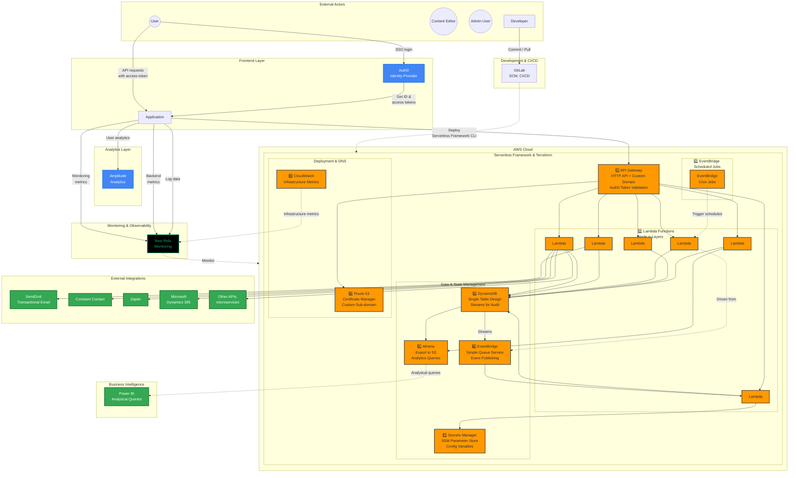

```mermaid
graph TB
    subgraph External["External Users"]
        EndUser((End User))
        ContentEditor((Content<br/>Editor))
        AdminUser((Admin<br/>User))
    end
    
    subgraph Application["1️⃣ Application Layer<br/>Vercel + Next.js + Tailwind"]
        NextJS[Next.js<br/>Static Site Generation<br/>Edge Caching via Vercel]
    end
    
    subgraph CMS["2️⃣ Headless CMS<br/>Contentful"]
        Contentful[Contentful<br/>Content Management]
    end
    
    subgraph Backend["3️⃣ Microservice Layer"]
        Lambda[AWS Lambda]
        DynamoDB[DynamoDB]
    end
    
    subgraph Admin["4️⃣ Admin Console<br/>Retool"]
        Retool[Retool<br/>Low-Code Admin Interface<br/>Role-Based Access Control]
    end
    
    EndUser -->|Browse<br/>website| NextJS
    
    ContentEditor -->|Manage content<br/>in CMS| Contentful
    Contentful -.->|Regenerate static content<br/>when changes made<br/>On-demand revalidation| NextJS
    
    NextJS -->|Load dynamic data<br/>perform actions| Lambda
    Lambda --> DynamoDB
    
    AdminUser -->|Manage<br/>microservice data| Retool
    Retool -->|Read & write| Lambda
    Retool -->|Read & write| DynamoDB
    
    classDef vercel fill:#000000,stroke:#ffffff,stroke-width:2px,color:#ffffff
    classDef contentful fill:#2478CC,stroke:#1a5490,stroke-width:2px,color:#ffffff
    classDef aws fill:#FF9900,stroke:#232F3E,stroke-width:2px,color:#232F3E
    classDef retool fill:#3D3D3D,stroke:#E8833A,stroke-width:2px,color:#E8833A
    
    class NextJS vercel
    class Contentful contentful
    class Lambda,DynamoDB aws
    class Retool retool
```

# SRF Audience Engagement Tech Stack

## Document Purpose

This document provides a complete technical reference for the SRF (Audience Engagement) technology stack, including guiding principles, vendor selections, standardized choices, and detailed architecture diagrams for both backend (serverless API) and frontend (Jamstack) applications.

---

## Quick Reference

| Question | Answer | Section Link |
|----------|--------|--------------|
| What's the backend stack? | AWS Lambda + API Gateway + DynamoDB (serverless microservices) | [Backend Architecture](#architecture-serverless-api-backend) |
| What's the frontend stack? | Next.js on Vercel + Contentful CMS (Jamstack) | [Frontend Architecture](#architecture-jamstack-application-frontend) |
| How do we authenticate? | Auth0 (Identity-as-a-Service) | [Security](#security-considerations) |
| What cloud provider? | AWS (primary), Vercel (frontend), Cloudflare (edge) | [Cloud Vendors](#cloud-vendors--services) |
| What languages? | TypeScript + Node.js (backend), TypeScript + Next.js (frontend) | [Standards](#standardized-technology-choices) |
| How do we deploy? | GitLab CI/CD with Serverless Framework + Terraform | [Deployment](#deployment-workflows) |
| What environments? | dev, qa, stg, prod | [Environments](#environment-configuration) |
| How do we monitor? | New Relic (APM), Sentry (errors), Amplitude (analytics) | [Observability](#observability-stack) |

---

## Guiding Principles

### Infrastructure Philosophy

1. **Serverless-First**: Utilize SaaS and serverless as much as possible to reduce operational overhead
   - Example: Utilize serverless Lambda functions rather than an EC2-based application
   - Example: Utilize Cloudflare Images rather than building an in-house image pipeline on AWS, etc.

2. **Cloud Consolidation**: When possible and practical, utilize infrastructure choices from existing cloud providers to limit cloud sprawl
   - Example: Do not add something from GCP if there is an equivalent in AWS, etc.

3. **Specialized Tool Selection**: When a specialized tech vendor does something significantly better than AWS, utilize that over the less-impressive AWS equivalent
   - Auth0 over AWS Cognito (authentication)
   - Vercel over AWS Amplify (frontend hosting)
   - Neon over AWS Aurora Serverless (PostgreSQL database)

4. **Infrastructure as Code (IaC)**: All infrastructure should be defined as Infrastructure-as-Code and deployable via a GitLab CI/CD pipeline

5. **Environment Standardization**: Except in special cases, always work in our four standard environments
   - `dev` (development)
   - `qa` (quality assurance)
   - `stg` (staging)
   - `prod` (production)

6. **Environment Isolation**: Integrate with other SRF products and services within the same environment
   - Examples: dev to dev, qa to qa, etc.

7. **Avoid Redundancy**: Where a standard has already been established in SRF, utilize that rather than introducing something new which overlaps
   - Example: Do not introduce Datadog for observability if SRF has already adopted New Relic

8. **IDP Adoption**: As an SRF IDP (Internal Developer Platform) has been established, all new applications created going forward should be built on the SRF IDP utilizing the project templates made available in GitLab
   - Consult with the SRF AE architect if a project template suitable for your use case is not available

---

## Cloud Vendors & Services

### Primary Infrastructure

| Vendor | Type | Description |
|--------|------|-------------|
| **AWS** | Cloud Infrastructure | Primary cloud infrastructure provider |
| **Vercel** | Frontend Hosting | Frontend cloud infrastructure provider for Next.js applications |
| **Cloudflare** | Edge Platform | DNS, Security (WAF, DDoS, bot protection, etc.), performance (CDN), edge network (serverless edge functions, URL rewriting, etc.), image optimization, etc. |

### Specialized Services

| Vendor | Category | Description |
|--------|----------|-------------|
| **Auth0** | Identity | Identity-as-a-Service provider (authentication, authorization) |
| **Contentful** | CMS | Content management |
| **SendGrid** | Email | Transactional email delivery (email templates designed in Stripo) |
| **Vimeo** | Video | Private video hosting |
| **Cloudflare Images** | Media | Image optimization and delivery |
| **Stripe** | Payments | Payment processing |
| **Neon** | Database | Serverless PostgreSQL database |

### Observability & Analytics

| Vendor | Purpose |
|--------|---------|
| **New Relic** | Observability |
| **Sentry** | Error reporting |
| **Amplitude** | Analytics |

### Development Tools

| Tool | Purpose |
|------|---------|
| **Retool** | Low-code platform for internal tools (admin panels, dashboards, support tools, etc.) |
| **GitLab** | Unified DevOps platform (SCM, CI/CD, Terraform state management, DevSecOps, etc.) |

---

## Standardized Technology Choices

### Languages & Frameworks

| Layer | Technology | Details |
|-------|-----------|---------|
| **Backend** | TypeScript / Node.js | Server-side logic, API development |
| **Frontend** | TypeScript / Next.js | Client-side applications, SSG/ISR |

### Infrastructure as Code (IaC)

| Tool | Use Case | Notes |
|------|----------|-------|
| **Serverless Framework v4** | AWS API Gateway + Lambda | Integrated into SRF IDP |
| **Terraform** | Everything else | Integrated into SRF IDP |

**Note**: Serverless Framework v4 and Terraform have both been integrated into the SRF IDP in a way which is seamless for the developer and adheres to SRF standards, so it is sufficient to build on the SRF IDP.

### Development Standards

| Category | Technology | Notes |
|----------|-----------|-------|
| **API Testing** | Postman | Test collections and environments |
| **API Documentation** | OpenAPI spec | Generated automatically from Postman collection |
| **Versioning** | Semantic Versioning | Major.Minor.Patch (semver) |
| **Git Commits** | Conventional Commits | Structured commit messages |
| **CSS & UI** | Tailwind, Headless UI, Tailwind UI, Catalyst | Utility-first CSS framework + components |
| **E2E Testing** | Cypress | End-to-end automated testing |
| **Testing Platform** | LambdaTest | Test case management, cross-browser testing, etc. |

---

## Architecture: Serverless API (Backend)

### Title
**Standard application tech stack: serverless API (backend)**

### Subtitle
**Recommended Technology Stack - Microservice**

### Overview
The backend architecture follows a microservice pattern built on AWS serverless technologies with comprehensive integrations for analytics, monitoring, external services, and developer tooling.

### Architecture Diagram (Mermaid)



### Component Details (Numbered Annotations)

#### 1️⃣ API Gateway

| Aspect | Details |
|--------|---------|
| **Technology** | AWS API Gateway (HTTP API type) |
| **Full Description** | HTTP API type with custom domain name. Custom authorizer to validate Auth0 access token. Each route should specify authorization scopes which correlate to API permission scopes defined for that API in Auth0. Throttling limits should be defined to protect APIs. |
| **Configuration** | • Custom domain name with SSL/TLS certificate<br>• Custom authorizer validates Auth0 access tokens<br>• Each route specifies authorization scopes correlating to API permission scopes defined for that API in Auth0<br>• Throttling limits defined to protect APIs |
| **Purpose** | Entry point for all API requests with authentication/authorization enforcement |

---

#### 2️⃣ Lambda

| Aspect | Details |
|--------|---------|
| **Technology** | AWS Lambda (Node.js runtime) |
| **Full Description** | Preferred language is Node.js. Layers should be used for package dependencies ('serverless-layers' plugin in Serverless Framework). |
| **Architecture** | • Multiple Lambda functions handling different business domains<br>• Layers used for package dependencies (serverless-layers plugin in Serverless Framework)<br>• Stateless, event-driven execution<br>• Auto-scaling based on demand |
| **Purpose** | Execute business logic for API endpoints and background jobs |

---

#### 3️⃣ EventBridge (Scheduled Jobs)

| Aspect | Details |
|--------|---------|
| **Technology** | AWS EventBridge |
| **Full Description** | Set schedules on Lambda functions defined in Serverless Framework for jobs which need to be run at regular intervals. |
| **Configuration** | • Schedules defined in Serverless Framework configuration<br>• Triggers Lambda functions at regular intervals (cron-like scheduling) |
| **Purpose** | Execute periodic background jobs (cleanup, data aggregation, scheduled notifications, etc.) |

---

#### 4️⃣ DynamoDB

| Aspect | Details |
|--------|---------|
| **Technology** | AWS DynamoDB |
| **Full Description** | Single-table design pattern should be used in most cases. Point-In-Time Recovery (PITR) should be enabled. DynamoDB Streams should be used for aggregating stats, creating audit logs, and in some cases taking actions based on changes in data. |
| **Design Pattern** | Single-table design (recommended for most cases) |
| **Features** | • Point-In-Time Recovery (PITR) enabled for continuous backups and granular restore capability<br>• DynamoDB Streams enabled for:<br>&nbsp;&nbsp;- Aggregating statistics<br>&nbsp;&nbsp;- Creating audit logs<br>&nbsp;&nbsp;- Triggering downstream actions based on data changes |
| **Purpose** | Primary data store for application state and business entities with built-in durability and recovery |


---

#### 5️⃣ Athena

| Aspect | Details |
|--------|---------|
| **Technology** | AWS Athena |
| **Full Description** | DynamoDB tables should be exported to S3 as JSON using a data pipeline or similar means. Athena should be used as an interface for efficiently running analytical queries against the DynamoDB table JSON object on S3. Tools like Power BI can be integrated with Athena. |
| **Integration** | • DynamoDB tables exported to S3 as JSON via data pipeline or similar means<br>• Athena used as interface for efficiently running analytical queries against the DynamoDB table JSON object on S3<br>• Tools like Power BI can be integrated with Athena |
| **Purpose** | Enable SQL-based analytics on operational data without impacting production database |

---

#### 6️⃣ EventBridge and Simple Queue Service

| Aspect | Details |
|--------|---------|
| **Technology** | AWS EventBridge + SQS |
| **Full Description** | Important events such as creation of a new registration or purchase should be published to an EventBridge event bus to be consumed by Lambda "subscribers." SQS queues can be leveraged for events which need to be handled (e.g. add user to Constant Contact mailing list), each one subscribed to the appropriate Lambda function which can then process the event and trigger a Lambda function. |
| **Use Cases** | • Important events (e.g., new registration, purchase) published to EventBridge event bus<br>• Consumed by Lambda "subscribers"<br>• SQS queues leveraged for events which need to be handled<br>• Example: Add user to Constant Contact mailing list<br>• Each queue subscribed to appropriate Lambda function<br>• Lambda processes event and triggers appropriate actions |
| **Purpose** | Event-driven architecture enabling loose coupling and asynchronous processing |

---

#### 7️⃣ Secrets Manager and SSM Parameter Store

| Aspect | Details |
|--------|---------|
| **Technology** | AWS Secrets Manager + AWS Systems Manager Parameter Store |
| **Full Description** | Config variables required by Lambda functions will sometimes be stored as environment variables, but in other cases may be stored in SSM Parameter Store (if non-sensitive) or Secrets Manager (if sensitive) to allow for easily making changes and increased security. |
| **Usage** | • **Environment Variables**: Config variables for Lambda functions (sometimes stored this way)<br>• **SSM Parameter Store**: Non-sensitive configuration (preferred for non-sensitive data)<br>• **Secrets Manager**: Sensitive credentials (if sensitive) for enhanced security<br>• Allows for easily making changes and increased security |
| **Purpose** | Centralized configuration and secrets management with encryption and access control |

---

#### 8️⃣ Route 53 and Certificate Manager

| Aspect | Details |
|--------|---------|
| **Technology** | AWS Route 53 + AWS Certificate Manager |
| **Full Description** | Custom sub-domain used by API Gateway should be defined in Route 53 with an SSL certificate from Certificate Manager. |
| **Configuration** | • Custom sub-domain for API Gateway defined in Route 53<br>• SSL certificate from Certificate Manager attached |
| **Purpose** | DNS management and SSL/TLS certificate provisioning for custom domains |

---

#### 9️⃣ CloudWatch

| Aspect | Details |
|--------|---------|
| **Technology** | AWS CloudWatch |
| **Full Description** | Infrastructure metrics should be streamed from CloudWatch to New Relic (our primary monitoring platform). Metrics can also be streamed to New Relic using the New Relic plugin for Serverless Framework. |
| **Features** | • Infrastructure metrics streamed from CloudWatch to New Relic (primary monitoring platform)<br>• Metrics can also be streamed to New Relic using New Relic plugin for Serverless Framework |
| **Purpose** | AWS-native monitoring and log aggregation (data exported to New Relic for unified observability) |

---

### External Integrations

| Integration | Purpose | Details |
|-------------|---------|---------|
| **SendGrid** | Transactional Email | Email templates designed in Stripo. Triggered by Lambda functions for user notifications, confirmations, alerts |
| **Constant Contact** | Email Marketing | Integration via API for subscriber management |
| **Zapier** | Automation | No-code integration platform. Enables workflows between SRF systems and third-party services |
| **Microsoft Dynamics 365** | CRM | Bidirectional data sync for customer relationship management |
| **Power BI** | Business Intelligence | Queries Athena for data visualization and reporting |

---

### Data Flow Patterns

#### User Request Flow
1. User authenticates via Auth0 (SSO)
2. Frontend receives access token
3. Request sent to API Gateway with token
4. API Gateway validates token with custom authorizer
5. Lambda function processes request
6. DynamoDB stores/retrieves data
7. Response returned to frontend
8. Analytics sent to Amplitude
9. Metrics logged to New Relic

#### Event-Driven Flow
1. Lambda function writes to DynamoDB
2. DynamoDB Stream triggers EventBridge
3. EventBridge routes event to SQS queue
4. Subscriber Lambda functions process event
5. Actions executed (email via SendGrid, CRM update, etc.)

#### Scheduled Job Flow
1. EventBridge cron rule triggers
2. Lambda function executes background task
3. Data processed/aggregated
4. Results stored in DynamoDB
5. Notifications sent if needed

---

## Architecture: Jamstack Application (Frontend)

### Title
**Standard application tech stack: Jamstack application (frontend)**

### Subtitle
**Recommended Technology Stack - Jamstack**

### Overview
The frontend architecture follows the Jamstack pattern with static site generation, headless CMS integration, serverless backend APIs, and admin tooling for content and microservice management.

### Architecture Diagram (Mermaid)



### Component Details (Numbered Annotations)

#### 1️⃣ Application

| Aspect | Details |
|--------|---------|
| **Technology** | Vercel + Next.js + Tailwind CSS |
| **Full Description** | Static content is generated in Next.js at build time, so calls to the CMS are made only at build time, not upon each request. The pre-rendered static content is served by the Next.js application on Vercel. Edge caching is provided by Vercel. |
| **Architecture** | • **Static Site Generation (SSG)**: Static content generated in Next.js at build time<br>• Calls to CMS made only at build time, not upon each request<br>• Pre-rendered static content served by Next.js application on Vercel<br>• **Edge Caching**: Provided by Vercel |
| **Build Process** | • Static content generated at build time<br>• CMS API calls made only at build time, not per-request<br>• Pre-rendered pages served by Next.js application on Vercel<br>• Edge caching provided by Vercel for optimal performance |
| **Purpose** | Deliver fast, SEO-friendly, scalable frontend experience |

---

#### 2️⃣ Headless CMS

| Aspect | Details |
|--------|---------|
| **Technology** | Contentful |
| **Full Description** | When changes are made in the CMS (Contentful), the affected pages should be rebuilt in Next.js using on-demand revalidation (one form of incremental static regeneration). Vercel automatically invalidates the edge cache upon ISR revalidation. |
| **Workflow** | 1. Content editors manage content through Contentful CMS UI<br>2. When changes made in CMS, affected pages rebuilt in Next.js using on-demand revalidation (one form of Incremental Static Regeneration)<br>3. Vercel automatically invalidates edge cache upon ISR revalidation<br>4. Contentful webhooks can trigger Vercel deployments |
| **Integration Pattern** | • Next.js fetches content from Contentful API during build<br>• ISR automatically invalidates edge cache upon revalidation<br>• No runtime CMS queries for static content |
| **Purpose** | Decouple content management from presentation layer, enable non-technical users to manage content |

---

#### 3️⃣ Microservice

| Aspect | Details |
|--------|---------|
| **Technology** | AWS Lambda + DynamoDB |
| **Full Description** | See the Tech Stack - Microservice diagram. There may be one or more microservices which the application interacts with to facilitate the various functions of the application. |
| **Reference** | See detailed "Serverless API (Backend)" diagram and documentation above |
| **Integration** | • Frontend loads dynamic data from microservice APIs<br>• User actions (form submissions, transactions) trigger API calls<br>• Multiple microservices may exist for different application functions |
| **Purpose** | Handle dynamic functionality, user interactions, business logic not suitable for static generation |

---

#### 4️⃣ Admin Console

| Aspect | Details |
|--------|---------|
| **Technology** | Retool (low-code platform) |
| **Full Description** | Provides an administrative interface for a microservice. Retool (a low-code platform) should be used in most cases. Role-based access control utilizing Auth0 roles should be leveraged so that only the menu items and functionality appropriate to the role of the currently logged-in admin are displayed. |
| **Use Cases** | • Provides administrative interface for microservice<br>• Internal dashboards and support tools<br>• Database record management (CRUD operations)<br>• Retool should be used in most cases |
| **Access Control** | • Role-based access control utilizing Auth0 roles<br>• Menu items and functionality restricted to authorized roles<br>• Only appropriate features displayed for logged-in admin users based on their role |
| **Integration** | • Direct read/write access to DynamoDB<br>• API calls to Lambda functions for complex operations<br>• Shared authentication with main application via Auth0 |
| **Purpose** | Provide internal tools without custom development effort, rapid admin interface creation |

---

### Data Flow Patterns

#### Static Content Delivery
1. Content editor updates content in Contentful
2. Webhook triggers Next.js revalidation
3. Next.js rebuilds affected pages (on-demand revalidation)
4. Updated static pages deployed to Vercel edge network
5. Vercel automatically invalidates edge cache upon ISR revalidation
6. End users receive updated content from edge cache

#### Dynamic Functionality
1. User interacts with Next.js application
2. Client-side JavaScript calls microservice API
3. Lambda function processes request
4. DynamoDB returns data
5. Response rendered in browser

#### Admin Management
1. Admin user logs into Retool with Auth0
2. Role-based permissions determine available features
3. Admin performs CRUD operations
4. Retool updates DynamoDB directly or via Lambda API
5. Changes reflected in main application

---

## Technology Decision Matrix

### When to Use Each Stack Component

| Use Case | Technology Choice | Rationale |
|----------|------------------|-----------|
| User authentication | Auth0 | Superior to AWS Cognito, better developer experience |
| Frontend hosting | Vercel | Optimized for Next.js, excellent edge performance |
| Backend APIs | AWS Lambda | Serverless, auto-scaling, cost-effective |
| Database | DynamoDB | Serverless, single-table design for microservices |
| Analytics queries | Athena | SQL queries on exported DynamoDB data |
| Event processing | EventBridge + SQS | Decoupled event-driven architecture |
| Secrets management | Secrets Manager / Parameter Store | Centralized, encrypted configuration |
| Content management | Contentful | Best-in-class headless CMS |
| Email delivery | SendGrid | Reliable transactional email service |
| Admin interfaces | Retool | Rapid development, role-based access |
| Monitoring | New Relic | Unified observability across stack |
| Error tracking | Sentry | Detailed error context and debugging |
| Product analytics | Amplitude | User behavior tracking and insights |

---

## Deployment Workflows

### Backend Deployment (Serverless Framework + Terraform)
1. Developer commits code to GitLab repository
2. GitLab CI/CD pipeline triggered
3. Serverless Framework CLI deploys Lambda functions + API Gateway
4. Terraform applies infrastructure changes (DynamoDB, EventBridge, etc.)
5. Deployment succeeds to target environment (dev/qa/stg/prod)
6. CloudWatch metrics streamed to New Relic
7. Sentry configured for error reporting

### Frontend Deployment (Vercel)
1. Developer commits code to GitLab repository
2. GitLab webhook triggers Vercel deployment
3. Vercel builds Next.js application
4. Static assets deployed to edge network
5. Contentful content fetched during build
6. ISR configuration applied for dynamic revalidation
7. Deployment complete with preview URL

### Infrastructure as Code Workflow
1. Infrastructure changes defined in Terraform/Serverless Framework
2. Changes committed to GitLab repository
3. CI/CD pipeline runs `terraform plan` / `serverless deploy --dry-run`
4. Manual approval required for production
5. Pipeline applies infrastructure changes
6. State stored in GitLab Terraform backend
7. Deployment status reported in GitLab

---

## Environment Configuration

### Standard Environments

| Environment | Purpose | Deployment Trigger | Data Type | Integration Scope |
|-------------|---------|-------------------|-----------|-------------------|
| **dev** | Active development | Automatic on `develop` branch commit | Synthetic/test data | Integrates with dev services only |
| **qa** | Quality assurance testing | Manual promotion from dev | Test data | Integrates with qa services only |
| **stg** | Staging (pre-production) | Manual promotion from qa | Production-like data | Integrates with stg services only |
| **prod** | Production | Manual promotion from stg | Live customer data | Integrates with prod services only |

### Environment Isolation Rules
- **No cross-environment integration**: dev integrates with dev services, prod with prod services
- **Separate AWS accounts**: Each environment in isolated AWS account (recommended)
- **Separate Auth0 tenants**: Each environment has dedicated Auth0 tenant
- **Separate Contentful spaces**: Each environment has separate CMS space
- **Independent databases**: No shared DynamoDB tables across environments

---

## Security Considerations

### Authentication & Authorization
- **Auth0** handles all user authentication
- **JWT tokens** passed to API Gateway
- **Custom authorizer** validates tokens and checks scopes
- **Role-based access control** enforced in Retool admin interfaces

### Secrets Management
- **Never commit secrets** to Git repositories
- **Secrets Manager** for sensitive credentials (API keys, passwords)
- **Parameter Store** for non-sensitive configuration
- **Environment variables** injected at deployment time

### Network Security
- **Cloudflare WAF** protects against common web exploits
- **DDoS protection** at Cloudflare edge
- **Bot protection** filters malicious traffic
- **API Gateway throttling** prevents abuse
- **Lambda execution role** follows least-privilege principle

### Data Protection
- **Encryption at rest**: DynamoDB encryption enabled
- **Encryption in transit**: HTTPS/TLS for all communications
- **Audit logging**: DynamoDB Streams capture data changes
- **Access logging**: CloudWatch logs all API requests

---

## Observability Stack

### Monitoring Layers

| Layer | Tool | Purpose |
|-------|------|---------|
| **Application Metrics** | New Relic APM | Tracks Lambda performance, errors, transactions |
| **Infrastructure Metrics** | CloudWatch → New Relic | Unified view of AWS infrastructure |
| **Error Tracking** | Sentry | Captures detailed error context with stack traces |
| **User Analytics** | Amplitude | Tracks user behavior, feature usage, conversions |
| **Log Aggregation** | New Relic Logs | Centralizes CloudWatch logs |

### Key Metrics to Monitor

| Metric Category | Specific Metrics |
|-----------------|------------------|
| **API Performance** | Response time distribution (p50, p95, p99) |
| **Error Rates** | 4xx/5xx error percentages |
| **Lambda Performance** | Execution time per function, memory usage |
| **Database Performance** | DynamoDB read/write capacity consumption, throttling |
| **Cold Starts** | Lambda initialization delays, frequency |
| **User Engagement** | Amplitude funnel analysis, conversion rates |

---

## Development Workflow

### Project Initialization
1. Select appropriate SRF IDP project template from GitLab
2. Initialize new project with template
3. Configure environment variables for dev environment
4. Deploy to dev environment via GitLab CI/CD
5. Verify deployment in New Relic and Sentry

### Feature Development
1. Create feature branch from `develop`
2. Implement feature with TypeScript + Node.js (backend) or Next.js (frontend)
3. Write Cypress E2E tests for new functionality
4. Commit with Conventional Commits message format
5. Create merge request in GitLab
6. Automated tests run in CI/CD pipeline
7. Code review by team members
8. Merge to `develop` triggers dev deployment

### Testing Strategy

| Test Type | Tool | Purpose |
|-----------|------|---------|
| **Unit Tests** | Jest | Business logic testing |
| **Integration Tests** | Postman | API contract validation |
| **E2E Tests** | Cypress | Critical user journey testing |
| **Cross-Browser** | LambdaTest | Browser compatibility validation |
| **Performance** | Custom scripts | Load testing in staging |

---

## API Documentation Standards

### OpenAPI Specification
- **Source of Truth**: Postman collections define API contract
- **Auto-Generation**: OpenAPI spec generated from Postman collection
- **Versioning**: Semantic versioning applied to API versions
- **Documentation Portal**: Auto-generated docs hosted for developers

### Postman Best Practices
- **Environment variables**: Separate collections for each environment
- **Request examples**: Include sample requests/responses
- **Test scripts**: Automated validation of responses
- **Collections hierarchy**: Organized by resource/domain

---

## Cost Optimization

### Serverless Cost Management

| Strategy | Implementation |
|----------|----------------|
| **Lambda Concurrency** | Provisioned concurrency only for critical production functions |
| **DynamoDB Billing** | On-demand for unpredictable traffic, provisioned for steady-state |
| **S3 Lifecycle** | Archive old data to Glacier after retention period |
| **CloudWatch Logs** | 30-day retention for dev, 90 days for prod |
| **Athena Optimization** | Partition data, use columnar formats (Parquet) |

### Vercel Cost Management

| Strategy | Implementation |
|----------|----------------|
| **Edge Caching** | Maximize cache hit ratio with proper headers |
| **Image Optimization** | Use Vercel native image optimization |
| **ISR Strategy** | Incremental static regeneration reduces full builds |
| **Build Efficiency** | Optimize CI/CD pipeline to reduce build minutes |

---

## Disaster Recovery

### Backup Strategy

| Asset | Backup Method | Frequency | Retention |
|-------|---------------|-----------|-----------|
| **DynamoDB** | Point-in-time recovery (PITR) | Continuous | 35 days |
| **Contentful** | Built-in versioning | On every change | Unlimited |
| **GitLab Code** | Repository mirrors | Real-time | Indefinite |
| **Secrets** | Encrypted S3 export | Weekly | 90 days |

### Recovery Procedures

| Scenario | Procedure | RTO | RPO |
|----------|-----------|-----|-----|
| **Database Loss** | Restore from DynamoDB PITR or on-demand backup | < 2 hours | < 1 hour |
| **Infrastructure Loss** | Terraform apply from Git repository | < 4 hours | 0 (IaC) |
| **Application Loss** | GitLab CI/CD pipeline re-run | < 1 hour | 0 (Git) |
| **Complete Disaster** | Full stack recreation from IaC + backups | < 4 hours | < 1 hour |

---

## Migration & Onboarding

### Adopting SRF IDP

| Phase | Steps |
|-------|-------|
| **1. Assessment** | • Assess current application<br>• Identify gaps with SRF standards |
| **2. Planning** | • Select project template<br>• Plan migration strategy |
| **3. Refactoring** | • Align with TypeScript + Node.js/Next.js standards<br>• Migrate infrastructure to Terraform/Serverless Framework |
| **4. Integration** | • Configure CI/CD in GitLab<br>• Enable monitoring (New Relic, Sentry, Amplitude) |
| **5. Deployment** | • Deploy to dev environment<br>• Validate feature parity |
| **6. Promotion** | • Promote through qa → stg → prod |

### Team Onboarding

| Step | Activity |
|------|----------|
| **1. Training** | Attend SRF IDP platform overview session |
| **2. Access** | Provision accounts: GitLab, AWS, Auth0, Contentful |
| **3. Documentation** | Read architecture guides and runbooks |
| **4. Shadowing** | Pair programming with senior developer |
| **5. Independence** | Implement small feature end-to-end independently |

---

## Appendix: Technology Justifications

### Why Auth0 over AWS Cognito?
- Superior developer experience
- Extensive identity provider integrations
- Advanced security features (anomaly detection, MFA)
- Better documentation and community support
- Customizable login pages without complex setup

### Why Vercel over AWS Amplify?
- Best-in-class Next.js support (same company)
- Superior edge network performance
- Simpler deployment workflow
- Better preview deployments
- Integrated analytics and monitoring

### Why Neon over AWS Aurora Serverless?
- True serverless PostgreSQL with instant scaling
- More cost-effective for variable workloads
- Better cold start performance
- Generous free tier for development
- Modern developer experience

### Why DynamoDB Single-Table Design?
- Reduced latency with fewer network calls
- Lower cost (fewer tables to provision)
- Atomic transactions across entity types
- Better fit for serverless access patterns
- Simplified backup/restore procedures

### Why Retool over Custom Admin?
- 10x faster development for internal tools
- Built-in access control and audit logging
- Pre-built components for CRUD operations
- Reduces frontend development burden
- Easy integration with existing backend APIs

---

## Glossary

| Term | Definition |
|------|------------|
| **IDP** | Internal Developer Platform - standardized templates and tooling for application development |
| **Jamstack** | JavaScript, APIs, and Markup - modern web architecture pattern |
| **SSG** | Static Site Generation - pre-rendering pages at build time |
| **ISR** | Incremental Static Regeneration - updating static pages without full rebuild |
| **PITR** | Point-In-Time Recovery - database backup with granular restore points |
| **IaC** | Infrastructure as Code - managing infrastructure through version-controlled files |
| **CI/CD** | Continuous Integration / Continuous Deployment - automated build and deploy pipelines |
| **WAF** | Web Application Firewall - protection against common web exploits |
| **DDoS** | Distributed Denial of Service - attack overwhelming services with traffic |
| **SSO** | Single Sign-On - one authentication for multiple applications |
| **JWT** | JSON Web Token - compact token format for authentication |
| **RTO** | Recovery Time Objective - maximum acceptable downtime |
| **RPO** | Recovery Point Objective - maximum acceptable data loss |
| **SQS** | Simple Queue Service - AWS message queuing service |
| **CDN** | Content Delivery Network - distributed network of servers for content delivery |
| **APM** | Application Performance Monitoring - real-time monitoring of application performance |

---

## Structured Data: Complete Technology Inventory

```yaml
architecture:
  backend:
    pattern: "Microservice - Serverless"
    primary_cloud: "AWS"
    compute: "AWS Lambda"
    api_gateway: "AWS API Gateway (HTTP API)"
    database: "AWS DynamoDB"
    analytics_db: "AWS Athena"
    event_bus: "AWS EventBridge"
    queue: "AWS SQS"
    secrets: "AWS Secrets Manager + SSM Parameter Store"
    dns: "AWS Route 53"
    certificates: "AWS Certificate Manager"
    monitoring_native: "AWS CloudWatch"
    
  frontend:
    pattern: "Jamstack"
    hosting: "Vercel"
    framework: "Next.js"
    css: "Tailwind CSS"
    ui_components: ["Headless UI", "Tailwind UI", "Catalyst"]
    cms: "Contentful"
    rendering: "Static Site Generation + Incremental Static Regeneration"
    
  edge_services:
    provider: "Cloudflare"
    description: "DNS, Security (WAF, DDoS, bot protection, etc.), performance (CDN), edge network (serverless edge functions, URL rewriting, etc.), image optimization, etc."
    categories:
      dns: "Domain name services"
      security: 
        - "WAF"
        - "DDoS protection"
        - "bot protection"
        - "etc."
      performance:
        - "CDN"
      edge_network:
        - "serverless edge functions"
        - "URL rewriting"
        - "etc."
      image:
        - "image optimization"
        - "etc."
    
  identity:
    provider: "Auth0"
    description: "Identity-as-a-Service provider (authentication, authorization)"
    features: ["Authentication", "Authorization", "SSO", "MFA", "Social Login"]
    
  observability:
    apm: "New Relic"
    error_tracking: "Sentry"
    analytics: "Amplitude"
    
  integrations:
    email: "SendGrid"
    email_templates: "Stripo"
    video: "Vimeo"
    images: "Cloudflare Images"
    payments: "Stripe"
    marketing: "Constant Contact"
    automation: "Zapier"
    crm: "Microsoft Dynamics 365"
    bi: "Power BI"
    database_external: "Neon"
    
  development:
    scm: "GitLab"
    cicd: "GitLab CI/CD"
    iac: 
      - "Serverless Framework v4"
      - "Terraform"
    api_testing: "Postman"
    api_docs: "OpenAPI"
    e2e_testing: "Cypress"
    cross_browser_testing: "LambdaTest"
    internal_tools: "Retool"
    
  standards:
    backend_language: "TypeScript"
    backend_runtime: "Node.js"
    frontend_language: "TypeScript"
    frontend_framework: "Next.js"
    versioning: "Semantic Versioning"
    commit_format: "Conventional Commits"
    css_framework: "Tailwind"
    ui_components: ["Headless UI", "Tailwind UI", "Catalyst"]
    
environments:
  - name: "dev"
    purpose: "Active development"
    deployment: "Automatic on develop branch commit"
    data: "Synthetic/test data"
    isolation: "Integrates with dev services only"
    
  - name: "qa"
    purpose: "Quality assurance"
    deployment: "Manual promotion from dev"
    data: "Test data"
    isolation: "Integrates with qa services only"
    
  - name: "stg"
    purpose: "Staging/pre-production"
    deployment: "Manual promotion from qa"
    data: "Production-like data"
    isolation: "Integrates with stg services only"
    
  - name: "prod"
    purpose: "Production"
    deployment: "Manual promotion from stg"
    data: "Live customer data"
    isolation: "Integrates with prod services only"
```

---

## Document Metadata

- **Version**: 1.0.2
- **Last Updated**: 2024
- **Maintained By**: SRF Audience Engagement Architecture Team
- **Target Audience**: AI systems, developers, architects, DevOps engineers
- **Format**: Markdown with Mermaid diagrams and strategic tables
- **Purpose**: Complete technical reference for AI-assisted development and architecture discussions
- **Completeness**: All information from PDF text and architecture diagrams fully restored with enhanced table formatting

---

**End of Document**